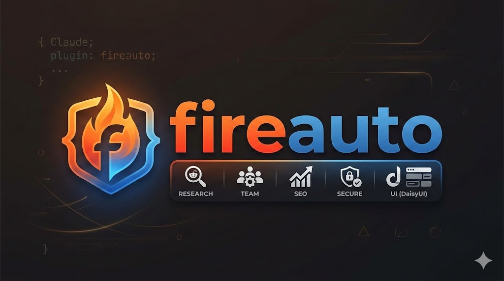

<p align="center">
  
</p>

<h1 align="center">fireauto</h1>

<p align="center">
  1년간 Claude Code를 쓰면서 쌓인 기억을 플러그인으로 만들었어요.<br/>
  AI 서비스 40개를 만들면서 매일 반복한 작업들,<br/>
  이제 커맨드 하나로 누구나 쓸 수 있어요.
</p>

<p align="center">
  <a href="#시작하기">시작하기</a> · <a href="#어떤-상황에서-뭘-쓰면-되나요">기능 가이드</a> · <a href="#각-기능-상세">상세 설명</a> · <a href="#자주-묻는-질문">FAQ</a>
</p>

<p align="center">
  <a href="https://github.com/imgompanda/fireauto/stargazers"></a>
  <a href="https://github.com/imgompanda/fireauto/releases/latest"></a>
  <a href="https://github.com/imgompanda/fireauto/blob/main/LICENSE"></a>
</p>

<p align="center">
  도움이 됐다면 Star를 눌러주세요. 업데이트 소식을 받아볼 수 있어요.
</p>

---

## 이게 뭔가요?

**fireauto**는 Claude Code에서 쓸 수 있는 자동화 플러그인이에요.

1년 동안 Claude Code로 AI 서비스 40개를 만들었어요. 매번 SEO 점검하고, 보안 체크하고, 레딧에서 고객 찾고, PRD 쓰고... 같은 작업을 반복하더라고요. 그래서 그 과정에서 쌓인 노하우와 패턴을 전부 플러그인으로 만들었어요.

터미널에서 `/seo-manager`라고 입력하면 AI가 알아서 SEO를 점검하고,
`/security-guard`라고 입력하면 보안 취약점을 찾아줘요.

사람이 하면 반나절 걸리는 일을, 커맨드 하나로 끝낼 수 있어요.

---

## 시작하기

### 1단계: fireauto 설치

```bash
# Claude Code 안에서 실행
/plugin marketplace add imgompanda/fireauto
/plugin install fireauto@fireauto
```

설치 끝. 이제 `/seo-manager` 같은 커맨드를 바로 쓸 수 있어요.

> GitHub에서 안 되면: `git clone https://github.com/imgompanda/fireauto.git` → `/plugin marketplace add ./fireauto` → `/plugin install fireauto@fireauto`

### 2단계: 보일러플레이트가 필요한가요?

이미 프로젝트가 있다면 **건너뛰세요**. fireauto는 어떤 프로젝트에서든 바로 쓸 수 있어요.

새 프로젝트를 시작하려면 **[FireShip Starter Kit](https://github.com/imgompanda/FireShipZip3)**을 추천해요.
인증, 결제, AI, 이메일, 다국어가 다 들어있어요.

```bash
# 커맨드 하나로 자동 설치 (클론 + 의존성 + 환경변수 설정)
/fireship-install
```

또는 수동으로:

```bash
git clone https://github.com/imgompanda/FireShipZip3.git my-app
cd my-app && npm install && cp .env.example .env.local
```

[데모 보기](https://fire-ship-zip3.vercel.app) · [보일러플레이트 자세히 보기](https://github.com/imgompanda/FireShipZip3)

---

## 어떤 상황에서 뭘 쓰면 되나요?

### Claude Code 처음 쓴다면 (먼저 이거!)

```
0. /freainer  → 추천 MCP + LSP + 알림 훅을 한번에 설치해요
```

### 서비스를 처음 만드는 중이라면

```
1. /planner     → 아이디어를 기획서로 만들어요
2. /researcher  → 레딧에서 진짜 고객이 있는지 확인해요
3. /designer    → DaisyUI로 UI를 만들어요
```

### UI/UX를 개선하고 싶다면

```
4. /uiux-upgrade   → 내 서비스 UI/UX를 자동으로 점검하고 고쳐줘요
```

### 서비스를 거의 다 만들었다면

```
5. /seo-manager     → SEO가 제대로 되어있는지 점검해요
6. /security-guard  → 보안 구멍이 없는지 확인해요
```

### 영상 콘텐츠가 필요하다면

```
  /video-maker  → React 코드로 영상을 만들어요 (인트로, 자막, 차트 등)
```

### 규모가 큰 작업이라면

```
7. /team   → 여러 AI가 동시에 작업하고 서로 대화해요
```

### Claude Code를 더 빠르게 쓰고 싶다면

```
8. /lsp-install  → LSP를 켜서 코드 탐색 속도와 정확도를 극대화해요
```

### 프롬프트를 잘 못 쓰겠다면

```
9. /loop  → 프롬프트 하나만 던지면 AI가 알아서 반복하며 완성해요
```

---

## 전체 커맨드

| 커맨드 | 역할 | 한 줄 설명 |
|--------|------|-----------|
| `/planner` | 기획자 | 아이디어 한 줄 → 상세 PRD 문서 |
| `/researcher` | 리서처 | 레딧에서 고객 찾기 + 리드 스코어링 |
| `/team` | 팀 리더 | AI 팀 구성 + 병렬 작업 + 에이전트 간 대화 |
| `/team-status` | 팀 리더 비서 | AI 팀 진행 상황 확인 |
| `/seo-manager` | SEO 관리자 | SEO 7개 영역 자동 점검 |
| `/security-guard` | 보안 담당 | 코드 보안 취약점 8개 카테고리 점검 |
| `/designer` | 디자이너 | DaisyUI UI 구축 / 마이그레이션 / 테마 |
| `/uiux-upgrade` | UX 개선자 | 내 서비스 UI/UX 감사 + 자동 수정 |
| `/video-maker` | 영상 제작자 | React 코드로 영상 제작 (Remotion) |
| `/loop` | 반복 실행기 | AI가 반복하며 작업 완성 (ralph-loop 기반) |
| `/cancel-loop` | | 실행 중인 루프 중단 |
| `/fireship-install` | | FireShip 보일러플레이트 자동 설치 (멀티 결제 지원) |
| `/lsp-install` | LSP 셋업 | Claude Code에 LSP 연결 → 코드 탐색 극대화 |
| `/freainer` | 원클릭 세팅 | 추천 MCP + LSP + 알림 훅 한번에 설치 |

---

## 커맨드 vs 스킬(가이드)

fireauto에는 **커맨드**와 **스킬(가이드)** 두 종류가 있어요.

| 구분 | 커맨드 | 스킬(가이드) |
|------|--------|-------------|
| **이름 예시** | `/team`, `/seo-manager` | `fireauto-team-guide`, `fireauto-seo-guide` |
| **실행 방법** | `/` 입력해서 직접 실행 | AI가 상황에 맞게 **자동 실행** |
| **역할** | 특정 작업을 수행 | AI가 더 잘 작업하도록 배경 지식 제공 |

쉽게 말하면:
- **커맨드** = 내가 시키는 것 (`/seo-manager` → SEO 점검해!)
- **스킬(가이드)** = AI가 알아서 참고하는 것 (SEO 점검할 때 이렇게 하면 잘 돼요~)

> 스킬은 `-guide`가 붙어있어요. `/` 메뉴에 보이지만 직접 실행할 필요 없어요. AI가 필요할 때 알아서 가져다 써요.

---

## 각 기능 상세

### `/freainer` — 원클릭 세팅

Claude Code 처음 쓰는 사람도 커맨드 하나로 프로급 환경을 만들 수 있어요.

```
/freainer
```

자동으로 설치되는 것들:
- **Context7** — 라이브러리 최신 문서를 AI가 실시간 참조
- **Playwright** — 브라우저 자동화 + E2E 테스트
- **Draw.io** — 아키텍처도, 플로우차트, ERD 자동 생성
- **LSP** — 코드 탐색 속도와 정확도 극대화
- **알림 훅** — 작업 완료 시 macOS 알림
- **에이전트 팀** — 여러 AI가 동시 작업

전부 무료예요. API 키도 필요 없어요.

### `/planner` — 기획자

"이런 서비스 만들고 싶은데..." 한 줄만 적으면 상세한 기획서가 나와요.

```
/planner
```

9개 섹션을 자동으로 만들어요:
프로젝트 개요, 핵심 기능(P0/P1/P2), 실현 가능성 조사, 외부 API 가격 비교, 경쟁사 분석, 기술 스택 추천, 수익 모델, 구현 로드맵, 성공 지표

`docs/prd/` 폴더에 마크다운으로 저장돼요.

### `/researcher` — 리서처

레딧에서 관련 게시글을 찾아서, 누가 진짜 고객인지 1~10점으로 점수를 매겨줘요.

```
/researcher
```

결과물:
- **리드 점수표** (CSV) — hot/warm/cold/not_a_lead 4단계 분류
- **고충 분류** — 비용, 시간, 복잡성, 규제, 스케일 카테고리별 정리
- **요약 리포트** — 마크다운 문서

### `/team` — 팀 리더 (컴퍼니 모델)

여러 AI가 동시에 작업하고, 서로 대화하며 협업해요.

```
/team
```

- AI끼리 SendMessage로 실시간 논의
- 각자 독립된 공간(git worktree)에서 작업 → 코드 충돌 없음
- 작업 완료 후 자동으로 순차 병합

팀 상태 확인: `/team-status`

### `/seo-manager` — SEO 관리자

코드 기반으로 SEO 7개 영역을 점검해요. 빌드하지 않아도 돼요.

```
/seo-manager
```

점검 항목: robots.txt, sitemap, JSON-LD 구조화 데이터, 메타 태그, pSEO 라우트, 리다이렉트 체인, 성능 SEO

결과는 P0(긴급) ~ P3(개선 권장)으로 정리돼요.

### `/security-guard` — 보안 담당

코드에 보안 구멍이 없는지 8개 카테고리로 점검해요.

```
/security-guard
```

점검 항목: 시크릿 노출, 인증/인가 누락, Rate Limiting, 파일 업로드, 스토리지 보안, Prompt Injection, 정보 노출, 의존성 취약점

CRITICAL → HIGH → MEDIUM → LOW 순으로 보여주고, 수정 방법도 알려줘요.

### `/designer` — 디자이너

DaisyUI v5 기반으로 UI를 만들거나 바꿔줘요.

```
/designer
```

3가지 모드:
- **build** — 처음부터 DaisyUI로 UI 만들기
- **migrate** — shadcn/ui → DaisyUI 자동 변환
- **theme** — oklch() 컬러로 테마 설정

### `/uiux-upgrade` — UX 개선자

내 프로젝트의 UI/UX를 8개 카테고리로 감사하고, 발견된 문제를 직접 코드로 고쳐줘요.

```
/uiux-upgrade
```

감사 항목: 다크/라이트 모드 호환, 반응형 디자인, 접근성, 로딩 상태, 폼 UX, 네비게이션 일관성, 타이포그래피, 애니메이션

P0(긴급) ~ P3(개선 권장)으로 분류하고, 범위를 선택하면 자동으로 수정해줘요.

### `/video-maker` — 영상 제작자

React 기반 Remotion으로 코드로 영상을 만들어요. AI가 직접 영상 코드를 작성해요.

```
/video-maker
```

4가지 모드: init (프로젝트 셋업) / create (영상 제작) / edit (수정) / render (렌더링)

인트로, 텍스트 애니메이션, 차트, 자막, 3D, 장면 전환 등 다 가능해요.
Remotion MCP를 설치하면 30개+ 전문 규칙을 실시간 참조해요.

### `/lsp-install` — LSP 셋업

Claude Code에 LSP(Language Server Protocol)를 연결해서 코드 탐색을 극대화해요.

```
/lsp-install
```

LSP를 켜면 Claude Code가 텍스트 검색 대신 **코드 구조를 이해하면서** 탐색해요:
- **정의로 이동** — "이 함수 어디에 정의돼있어?" → 50ms 만에 찾아요
- **참조 찾기** — "이거 어디서 쓰이고 있어?" → 모든 사용처를 정확히 찾아요
- **호출 계층** — "이 함수를 누가 호출해?" → 전체 호출 흐름 추적
- **타입 확인** — 편집 직후 타입 에러 즉시 포착

초보자도 쉽게 설치할 수 있어요. "웹 개발", "백엔드 개발" 같은 카테고리를 고르면 알아서 필요한 것만 설치해요. 설치 후에는 AI가 자동으로 LSP를 우선 사용해요.

### `/loop` — 반복 실행기

프롬프트 하나 던지면, AI가 반복하면서 스스로 작업을 완성해요.

```
/loop TODO API 만들어줘 --completion-promise '모든 테스트 통과' --max-iterations 20
```

동작 방식:
1. AI가 작업 → 2. 나가려 하면 같은 프롬프트 재투입 → 3. 이전 작업 결과 보면서 개선 → 4. 완료 조건 달성 시 종료

초보자에게 특히 좋아요. 프롬프트를 잘 못 써도 반복하면서 알아서 완성해줘요.

중단: `/cancel-loop`

---

## 플러그인 관리

```bash
/plugin update fireauto      # 업데이트
/plugin disable fireauto     # 잠깐 끄기
/plugin enable fireauto      # 다시 켜기
/plugin uninstall fireauto   # 삭제
```

팀 전체가 쓰려면:
```bash
/plugin install fireauto@fireauto --scope project
```

---

## 자주 묻는 질문

### 돈이 드나요?

fireauto 자체는 **무료**예요. MIT 라이선스라 마음대로 쓰시면 돼요.

다만 Claude Code를 쓰려면 아래 중 하나가 필요해요:
- **Claude Max 구독** ($100/월 또는 $200/월) — 가장 추천
- **Claude Pro 구독** ($20/월) — 사용량 제한 있음
- **Anthropic API 크레딧** — 쓴 만큼 과금

### 에러가 나면 어떻게 하나요?

1. Claude Code 최신 버전 확인: `npm update -g @anthropic-ai/claude-code`
2. 플러그인 재설치: `/plugin uninstall fireauto` → `/plugin install fireauto@fireauto`
3. 그래도 안 되면 [이슈를 남겨주세요](https://github.com/imgompanda/fireauto/issues)

---

## FireShip 부트캠프

> **수익화 바이브 코딩 부트캠프** — 5일 만에 AI 서비스 기획부터 배포까지

fireauto를 만든 사람이 직접 가르치는 부트캠프예요.

### 이런 분에게 추천해요

- 유튜브 강의 따라 해봤는데 결국 내 서비스는 하나도 못 만든 분
- Claude Code + AI SDK로 직접 서비스를 만들고 싶은 분
- 만드는 것뿐 아니라 수익화까지 하고 싶은 분

### 5일 커리큘럼

| 날짜 | 내용 |
|------|------|
| Day 1 (월) | Claude Code 세팅 + AI SDK + MCP 활용 |
| Day 2 (화) | AI 이미지 생성 서비스, RAG 챗봇 구축 실습 |
| Day 3 (수) | 결제 연동 + 수익화 + 레딧 수요조사 + 아이디어 확정 |
| Day 4 (목) | 내 서비스 만들기 + 1:1 코칭 |
| Day 5 (금) | 완성 + 배포 + 런칭 준비 |

### 포함 내용

- 40개 서비스를 만들며 다듬은 **보일러플레이트 평생 제공** + 업데이트
- 기수별 단톡방 + **수료생 전용 커뮤니티** (전 기수 통합)
- 수요 검증, 고객 찾기, 세일즈, 비용 관리, 운영까지 전부

> S전자 강의 수강생 만족도 **4.8점** · 누적 수강생 **200명+** · **10명 한정** 소수 정예

**[부트캠프 자세히 보기 →](https://fireship.me/ko/bootcamp?utm_source=github&utm_medium=readme&utm_campaign=fireauto)**

---

## 기업 AX (AI Transformation)

> 강의에서 끝나지 않습니다. 실제로 돌아가는 시스템을 만들어드립니다.

### 제공 서비스

| 서비스 | 설명 | 성과 |
|--------|------|------|
| **임직원 교육** | 클로드 코드 기초부터 실무 활용. 비개발자도 참여 가능 | 업무 생산성 40%↑ |
| **맞춤형 자동화 구축** | 반복 업무를 AI 기반 자동화 시스템으로 전환 | 반복 업무 70% 절감 |
| **사내 툴 개발** | 외부 SaaS 대체하는 맞춤형 AI 툴 구축 | SaaS 비용 60% 절감 |

### 케이스 스터디

- **S전자** — MX·VD 사업부 대상 바이브 코딩 실무 교육 (만족도 4.8점)
- **SDS** — 도메인 지식 기반 니치 B2B SaaS 기획~해외 런칭 ($8K MRR 달성)
- **기업 맞춤 자동화** — 주간 보고서 자동 생성, 데이터 수집 파이프라인, 이메일 자동 분류

**[기업 문의하기 →](https://fireship.me/ko/enterprise?utm_source=github&utm_medium=readme&utm_campaign=fireauto)**

---

## About

Made by [FreAiner](https://fireship.me?utm_source=github&utm_medium=readme&utm_campaign=fireauto)

1년간 Claude Code로 AI 서비스 40개를 만들고, 그 중 3개를 수익화한 1인 개발자예요. S전자 등 기업 대상 AI 교육 15회 이상 진행했고, 그 과정에서 매일 반복하던 작업을 자동화한 도구들을 모아서 오픈소스로 공개합니다.

- Web: [fireship.me](https://fireship.me?utm_source=github&utm_medium=readme&utm_campaign=fireauto)
- Threads: [@freainer](https://www.threads.net/@freainer)

## License

MIT
